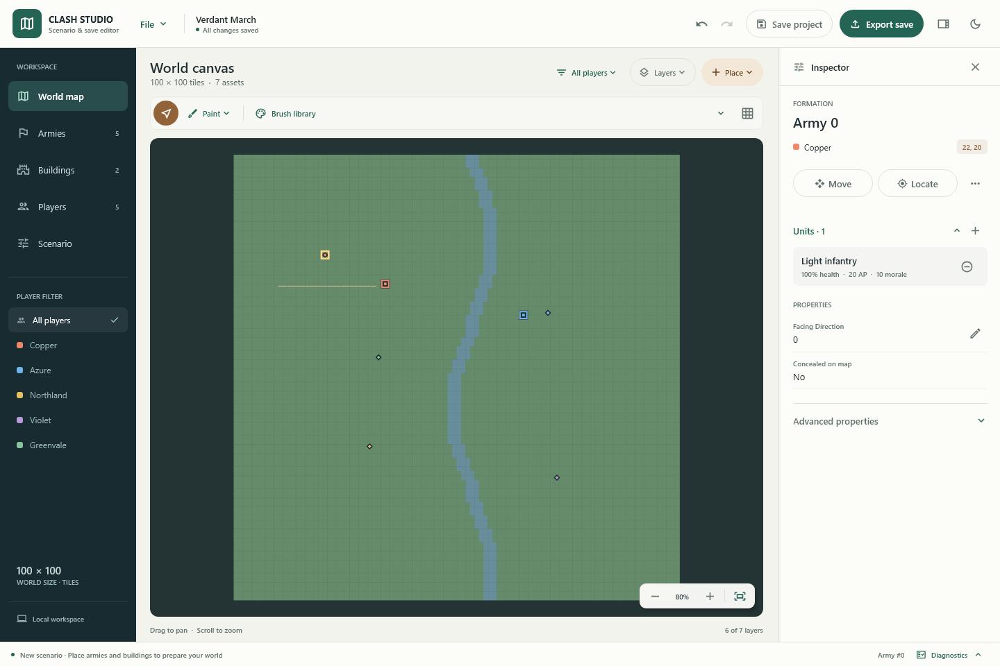

# Clash Studio

A desktop editor for **Clash saves and free-game scenarios**, built with Kotlin
and Compose Desktop. Create a world from an empty map, edit an existing save, or
inspect the original binary records through the desktop app and headless MCP
server. Map graphics are procedural; original game artwork is not required.



*Actual Compose render with a generated scenario. This is the editor workspace,
not an original-game capture.*

## What you can do

- **Start with a choice:** create a scenario from scratch, open a DAT or editor
  project, or return to a recent file.
- **Edit on the map:** pan, zoom, fit, toggle layers, place armies and buildings,
  and paint supported terrain, roads, sites, and traps.
- **Find and inspect:** search and filter entity tables, keep selection when
  switching views, and use **Locate** to center a selected asset on the map.
- **Make deliberate changes:** named player and unit choices, property dialogs
  with Apply/Cancel and validation, and transaction-wide undo/redo.
- **Keep the workspace readable:** light and dark themes, responsive navigation,
  a collapsible inspector, and diagnostics, reports, and source bytes available
  when needed. Advanced fields stay accessible without dominating everyday edits.

## Get started

### Run from source

Install **JDK 21**, then use the included Gradle wrapper from the repository root.
No separate Gradle installation is needed. The desktop app requires a display
and a window of at least 980×700.

Windows:

```powershell
.\gradlew.bat run
```

Linux or macOS:

```sh
./gradlew run
```

The build pins Gradle **8.14.4**, Kotlin/compiler **2.4.20**, and Compose
**1.12.1**. Compiled bytecode targets JVM 17; builds and packaged runtimes use
JDK 21.

### Windows portable application

Build the archive on Windows:

```powershell
.\gradlew.bat :desktop:portableZip
```

Extract `desktop/build/distributions/ClashSaveEditor-windows-x64.zip` and launch
`ClashSaveEditor/ClashSaveEditor.exe`. The archive includes Java, so the packaged
app does not need a separately installed runtime. `ClashSaveMcp.cmd` at the
archive root starts the headless server using the same bundled runtime.

The application image is also available under
`desktop/build/compose/binaries/main/app`. Successful Windows
[CI runs](https://github.com/lisu188/clash-save-editor/actions/workflows/ci.yml)
publish the portable archive as the `ClashSaveEditor-windows-x64` artifact.

## Create or edit a scenario

On launch, choose **Create scenario from scratch** or **Open existing save**.
Cancelling Open leaves the welcome screen in place. Once a document is open,
the **File** menu provides New, Open, and recent files.

1. **Set up the world.** A new scenario starts as an empty 100×100 grass map
   with recovered player and option defaults. Use **Players** to configure
   active slots, human/AI control, intelligence, religion, and names.
2. **Add starting forces.** Use **Place** on the world map to create armies and
   supported buildings. Select an asset to edit its owner, position, properties,
   and units in the inspector. Use the painting tools for supported map edits.
3. **Save your draft.** **Save project** stores a `.clashproj` at any stage,
   including unfinished scenarios. The toolbar shows whether changes are saved.
4. **Check playability.** Open **Diagnostics** from the status bar and use
   **Check playable save**. Structural checks and export requirements are shown
   separately; findings remain available until the document changes.
5. **Export for Clash.** **Export save** validates and writes the DAT/FAC pair.
   Export to a separate destination, then copy both files to a numbered
   `save/N.dat` and `save/N.fac` slot for the game's **Load Game** menu.

Playable export requires at least two active players, at least one human,
a valid army or qualifying building for every active player, valid ownership
and footprints, consistent occupancy, and supported FAC dependencies. A draft
can be saved without meeting these requirements.

Existing saves use the same workspace. Map and table selections refer to
physical records, so filtering does not change which entity is being edited.
Undo/redo restores the full transaction, including related occupancy and
supported FAC changes. See the [workspace guide](docs/studio-ui.md) for the
complete interface workflow.

### Keyboard shortcuts

| Action | Shortcut |
| --- | --- |
| New scenario | `Ctrl+N` |
| Open save or project | `Ctrl+O` |
| Save project | `Ctrl+S` |
| Export save | `Ctrl+Shift+S` |
| Undo | `Ctrl+Z` |
| Redo | `Ctrl+Y` or `Ctrl+Shift+Z` |
| Apply / cancel a property edit | `Enter` / `Escape` |

## Files and compatibility

| File | Purpose |
| --- | --- |
| `.clashproj` | Versioned editor project archive containing a manifest, DAT image, optional FAC content, and document encoding. Supports unfinished drafts. |
| `.dat` | Clash's fixed **586,414-byte** binary save image. |
| `.fac` | Companion rules-engine facts, including supported player and site state and existing mission logic. |

The game's DAT/FAC format is unchanged. No-op DAT/FAC round trips preserve
original bytes and formatting, including names, padding, unknown fields, and
unused records. The DAT format has no version marker or checksum. Its map and
occupancy storage always use a **100-cell row stride**, independently of visible
map bounds.

Names default to **Windows-1250** interpretation. The **Scenario** page lets you
change the document encoding without transcoding existing bytes; the choice is
undoable and saved in project metadata. Changed text must fit the field's byte
limit and be representable in the chosen encoding. Packed-field edits preserve
unrelated bits.

DAT/FAC export stages both files, preserves uniquely named backups, and records
a recovery journal. If replacement is interrupted, the app offers restoration
of the previous pair before opening it. Read the
[safety and integrity guide](docs/reverse-engineering/safety-and-integrity.md)
for the recovery and write guarantees.

### Supported editing boundaries

Structural editing follows recovered lifecycle evidence: building types **0–2**,
supported terrain/site/road presets, traps, and known free-game facts. Building
type **3** remains inspectable. Unknown FAC forms and campaign facts are
preserved. Campaign saves do not support dependency-sensitive structural edits;
unknown free-game dependencies also block operations that cannot be interpreted
safely. Independent fields remain editable where validation permits.

DAT-only inputs support inspection and independent scalar edits. Operations
that need rules state require the companion FAC; the editor does not invent
replacement campaign facts. New Game/Campaign menu integration, arbitrary
objective scripting, and original-art loading are outside the current scope.

The schema is pinned to `clash-disassembly` revision `c9c0fa7`. See the
[save format](docs/reverse-engineering/save-format.md),
[evidence and confidence](docs/reverse-engineering/clash-disassembly-evidence.md),
and [unknown fields](docs/reverse-engineering/unknown-fields.md) for the recovered
layout and its limits.

## Headless MCP server

Use the packaged `ClashSaveMcp.cmd`, or build and launch the standalone JAR:

```powershell
.\gradlew.bat :mcp:fatJar
java -jar mcp/build/libs/mcp-2.0.0-all.jar
```

On Linux or macOS, use `./gradlew :mcp:fatJar`. The server speaks JSON-RPC over
stdio; configure an MCP client to launch the command and communicate through
its standard input and output.

The existing seven tools remain available:

| Tool | Purpose |
| --- | --- |
| `save_get_schema` | Field names, ranges, evidence, and transaction requirements |
| `save_get_overview` | Save summary |
| `save_list_entities` | Filtered entity listing |
| `save_read_object` | Structured record inspection |
| `save_read_bytes` | Raw byte inspection |
| `save_set_property` | Validated independent property edit |
| `save_write_bytes` | Advanced raw byte write |

Existing `objectPath` selectors retain their filtered-index meaning. For stable
access, use `record` instead of `objectPath`; for example, the arguments for
reading physical army slot 499 are:

```json
{"path":"save/0.dat","record":{"kind":"army","slot":499}}
```

Unit selectors use `army_unit` or `building_unit` and add `"unitSlot": 0`.
Structured writes use shared core validation; fields needing paired updates
cannot be changed independently. Raw-byte writes are explicitly advanced.
Writes require `outputPath` unless `inPlace=true`; in-place writes keep the
non-clobbering `.bak`, `.bak.1`, … backup behavior. DAT-only MCP writes leave FAC
untouched.

## Development and verification

| Module | Responsibility |
| --- | --- |
| `core` | Byte-preserving record views, schema, transactional document, FAC handling, project archives, and DAT/FAC pair IO |
| `desktop` | Compose workspace, Canvas map, immutable UI snapshots, and file IO off the UI thread |
| `mcp` | Headless tools and the compatible subprocess protocol |

Run all tests on Windows:

```powershell
.\gradlew.bat test
```

Compose tests need a display. On headless Linux:

```sh
xvfb-run -a ./gradlew test
```

To retain actual rendered UI scenes from desktop tests:

```powershell
.\gradlew.bat :desktop:test -PstudioPreviewDir=build/reports/ui --rerun-tasks
```

Images are written under `desktop/build/reports/ui`. The layout journeys cover
980×700 and 1440×960 windows in both light and dark themes. The README screenshot
comes from the same generated scenarios; regeneration does not need retail
assets.

After building the Windows archive, verify its bundled runtime and MCP tools:

```powershell
.\tools\test-package.ps1 -Destination artifacts/package-check
```

Choose a new destination for each package check; the script preserves existing
output directories. Public CI runs on Windows and Linux with synthetic fixtures,
retains test reports and UI renders, and checks the Windows package separately.
Original-game acceptance is recorded independently from automated tests.

Further documentation:

- [Workspace and UI validation](docs/studio-ui.md)
- [Developer guide](docs/reverse-engineering/developer-guide.md)
- [Data invariants](docs/reverse-engineering/invariants.md)
- [Modernization validation](docs/modernization-validation.md)
- [Original-game acceptance](docs/original-game-acceptance.md)
